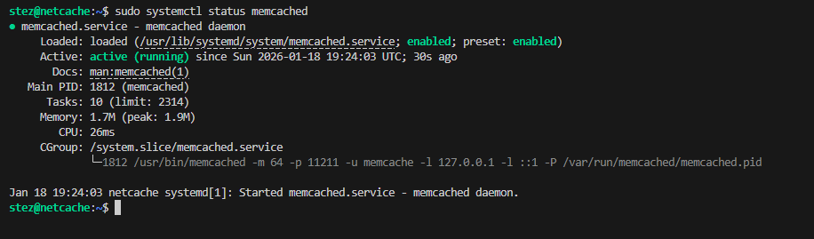
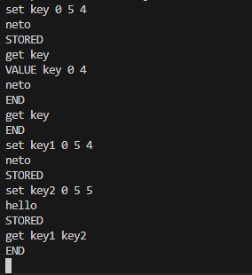
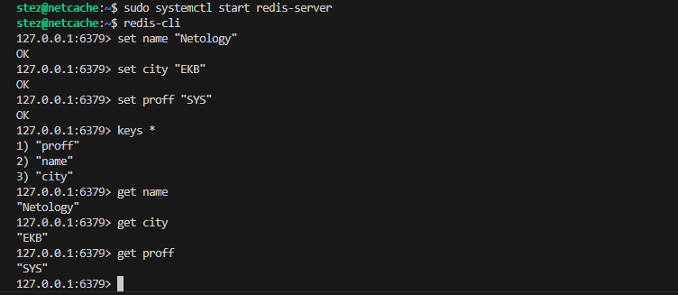
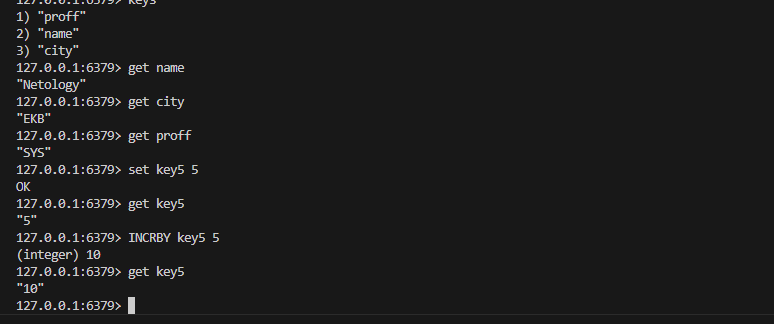

# Домашнее задание к занятию "`Кеширование Redis/memcached`" - `Александр М.`

### Задание 1. Кеширование 

Приведите примеры проблем, которые может решить кеширование. 

*Медленные запросы к БД. Перегрузку сервера. Тормозные страницы. Пиковые нагрузки.*

---

### Задание 2. Memcached

Установите и запустите memcached.

*Приведите скриншот systemctl status memcached, где будет видно, что memcached запущен.*

1. `sudo apt install memcached`
2. `sudo systemctl start memcached`
3. `sudo systemctl status memcached`

---

### Задание 3. Удаление по TTL в Memcached

Запишите в memcached несколько ключей с любыми именами и значениями, для которых выставлен TTL 5. 

*Приведите скриншот, на котором видно, что спустя 5 секунд ключи удалились из базы.*

1. `telnet 127.0.0.1 11211`

---

### Задание 4. Запись данных в Redis

Запишите в Redis несколько ключей с любыми именами и значениями. 

*Через redis-cli достаньте все записанные ключи и значения из базы, приведите скриншот этой операции.*

1. `sudo apt install redis-server`
2. `sudo systemctl start redis-server`
3. `redis-cli`

---

### Задание 5*. Работа с числами 

Запишите в Redis ключ key5 со значением типа "int" равным числу 5. Увеличьте его на 5, чтобы в итоге в значении лежало число 10.  

