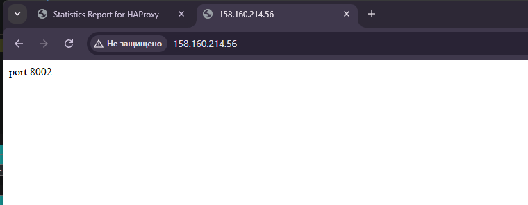
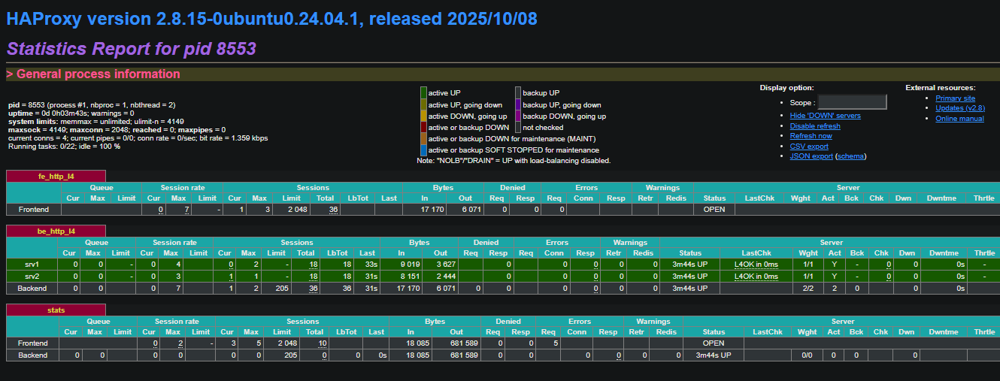
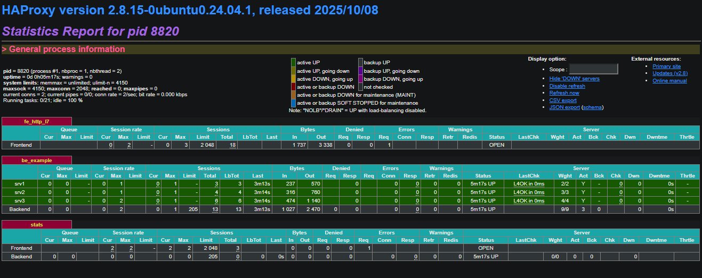
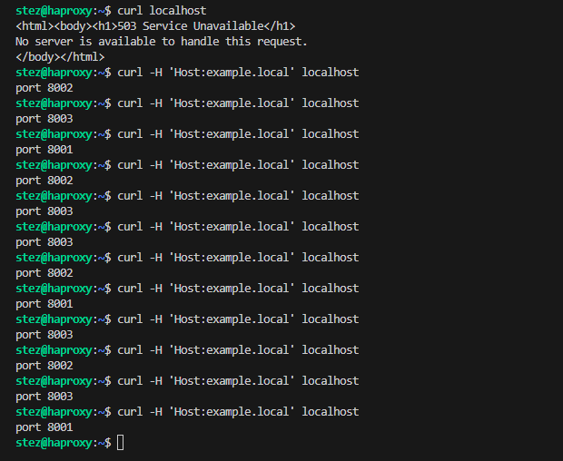

# Домашнее задание к занятию "`Кластеризация и балансировка нагрузки`" - `Александр М.`


### Задание 1

- Запустите два simple python сервера на своей виртуальной машине на разных портах
- Установите и настройте HAProxy, воспользуйтесь материалами к лекции по [ссылке](2/)
- Настройте балансировку Round-robin на 4 уровне.
- На проверку направьте конфигурационный файл haproxy, скриншоты, где видно перенаправление запросов на разные серверы при обращении к HAProxy.

### Решение

```
mkdir http1 && cd http1 && echo "port 8001" > index.html
mkdir http2 && cd http2 && echo "port 8002" > index.html
python3 -m http.server 8001
python3 -m http.server 8002
```

Конфиг файл:
[haproxy.cfg](zd1/haproxy.cfg)





---

### Задание 2

- Запустите три simple python сервера на своей виртуальной машине на разных портах
- Настройте балансировку Weighted Round Robin на 7 уровне, чтобы первый сервер имел вес 2, второй - 3, а третий - 4
- HAproxy должен балансировать только тот http-трафик, который адресован домену example.local
- На проверку направьте конфигурационный файл haproxy, скриншоты, где видно перенаправление запросов на разные серверы при обращении к HAProxy c использованием домена example.local и без него.

### Решение

```
mkdir http3 && cd http3 && echo "port 8003" > index.html
python3 -m http.server 8003
```
Конфиг файл:
[haproxy.cfg](zd2/haproxy.cfg)




---

