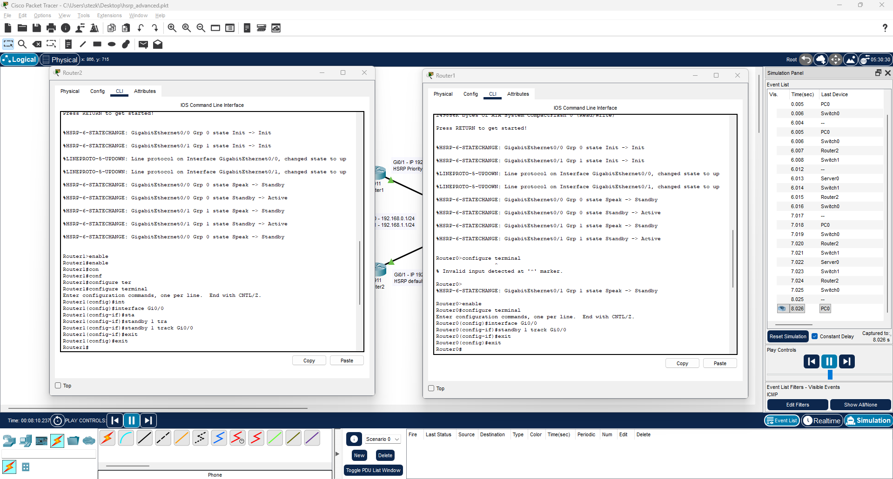
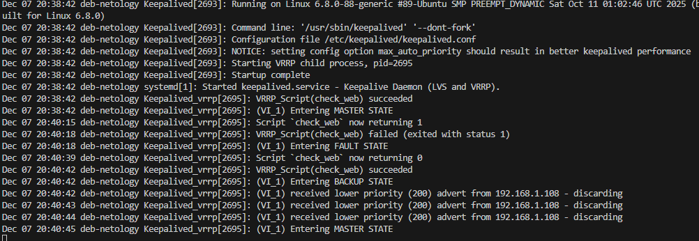
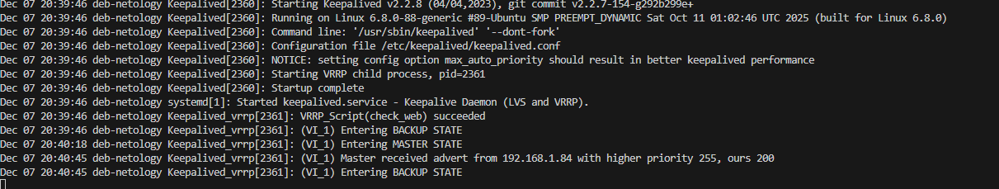

# Домашнее задание к занятию "`Disaster recovery и Keepalived`" - `Александр М.`

### Задание 1
- Дана [схема](1/hsrp_advanced.pkt) для Cisco Packet Tracer, рассматриваемая в лекции.
- На данной схеме уже настроено отслеживание интерфейсов маршрутизаторов Gi0/1 (для нулевой группы)
- Необходимо аналогично настроить отслеживание состояния интерфейсов Gi0/0 (для первой группы).
- Для проверки корректности настройки, разорвите один из кабелей между одним из маршрутизаторов и Switch0 и запустите ping между PC0 и Server0.
- На проверку отправьте получившуюся схему в формате pkt и скриншот, где виден процесс настройки маршрутизатора.


### Решение
```
Router 1
$ enable
# configure terminal
# interface Gi0/0
# standby 1 track Gi0/0

Router 2
$ enable
# configure terminal
# interface Gi0/0
# standby 1 track Gi0/0

```


[Редактированый hsrp_advanced.pkt](hsrp_advanced_edit.pkt)

---

### Задание 2
- Запустите две виртуальные машины Linux, установите и настройте сервис Keepalived как в лекции, используя пример конфигурационного [файла](1/keepalived-simple.conf).
- Настройте любой веб-сервер (например, nginx или simple python server) на двух виртуальных машинах
- Напишите Bash-скрипт, который будет проверять доступность порта данного веб-сервера и существование файла index.html в root-директории данного веб-сервера.
- Настройте Keepalived так, чтобы он запускал данный скрипт каждые 3 секунды и переносил виртуальный IP на другой сервер, если bash-скрипт завершался с кодом, отличным от нуля (то есть порт веб-сервера был недоступен или отсутствовал index.html). Используйте для этого секцию vrrp_script
- На проверку отправьте получившейся bash-скрипт и конфигурационный файл keepalived, а также скриншот с демонстрацией переезда плавающего ip на другой сервер в случае недоступности порта или файла index.html


### Решение

```
global_defs {
    script_user keepalived_script
    enable_script_security
}
vrrp_script check_web {
    script "/etc/keepalived/scripts/check_web.sh"
    interval 3
    fall 2
    rise 2
}

vrrp_instance VI_1 {
    state BACKUP
    interface enp0s8
    virtual_router_id 15
    priority 200
    advert_int 1
    authentication {
        auth_type PASS
        auth_pass 1111
    }
    virtual_ipaddress {
        192.168.1.171/24
    }
    track_script {
        check_web
    }
}
```
```
global_defs {
    script_user keepalived_script
    enable_script_security
}
vrrp_script check_web {
    script "/etc/keepalived/scripts/check_web.sh"
    interval 3
    fall 2
    rise 2
}

vrrp_instance VI_1 {
    state MASTER
    interface enp0s8
    virtual_router_id 15
    priority 255
    advert_int 1
    authentication {
        auth_type PASS
        auth_pass 1111
    }
    virtual_ipaddress {
        192.168.1.171/24
    }
    track_script {
        check_web
    }
}
```
[Bash Script](check_web.sh)






---
