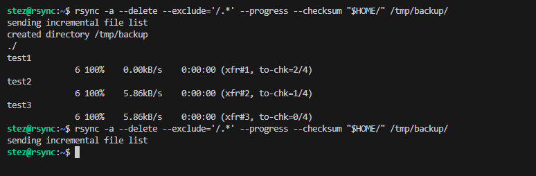
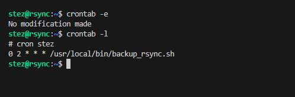
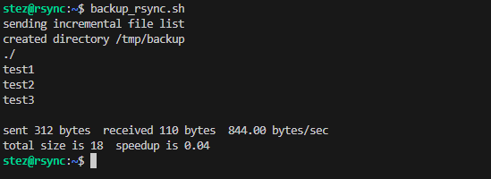
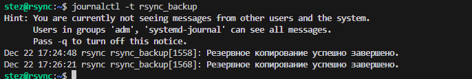

# Домашнее задание к занятию "`Резервное копирование`" - `Александр М.`

### Задание 1
- Составьте команду rsync, которая позволяет создавать зеркальную копию домашней директории пользователя в директорию `/tmp/backup`
- Необходимо исключить из синхронизации все директории, начинающиеся с точки (скрытые)
- Необходимо сделать так, чтобы rsync подсчитывал хэш-суммы для всех файлов, даже если их время модификации и размер идентичны в источнике и приемнике.
- На проверку направить скриншот с командой и результатом ее выполнения

### Решение

```
rsync -a --delete --exclude='/.*' --progress --checksum "$HOME/" /tmp/backup/
```

```
--exclude='/.*' – исключает скрытые файлы и директории
--checksum — сравнивает файлы по хэш‑суммам
```




---

### Задание 2
- Написать скрипт и настроить задачу на регулярное резервное копирование домашней директории пользователя с помощью rsync и cron.
- Резервная копия должна быть полностью зеркальной
- Резервная копия должна создаваться раз в день, в системном логе должна появляться запись об успешном или неуспешном выполнении операции
- Резервная копия размещается локально, в директории `/tmp/backup`
- На проверку направить файл crontab и скриншот с результатом работы утилиты.

### Решение

```
#!/bin/bash

LOGTAG="rsync_backup"

rsync -av --delete --exclude='/.*' --checksum "$HOME/" /tmp/backup/
STATUS=$?

if [ $STATUS -eq 0 ]; then
  logger -t "$LOGTAG" "Резервное копирование успешно завершено."
else
  logger -t "$LOGTAG" "Резервное копирование не удалось со статусом $STATUS"
fi

exit $STATUS
```




---
