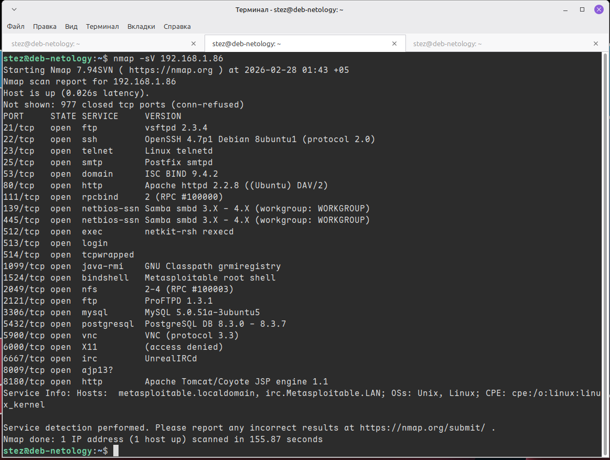
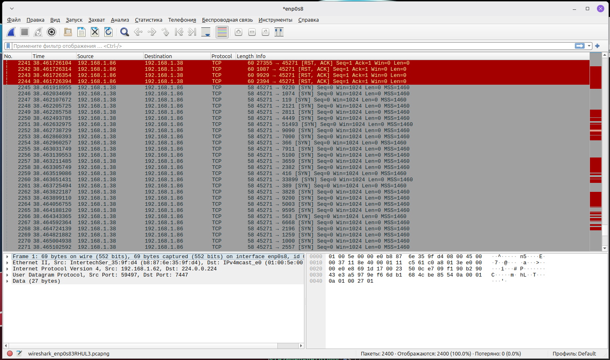
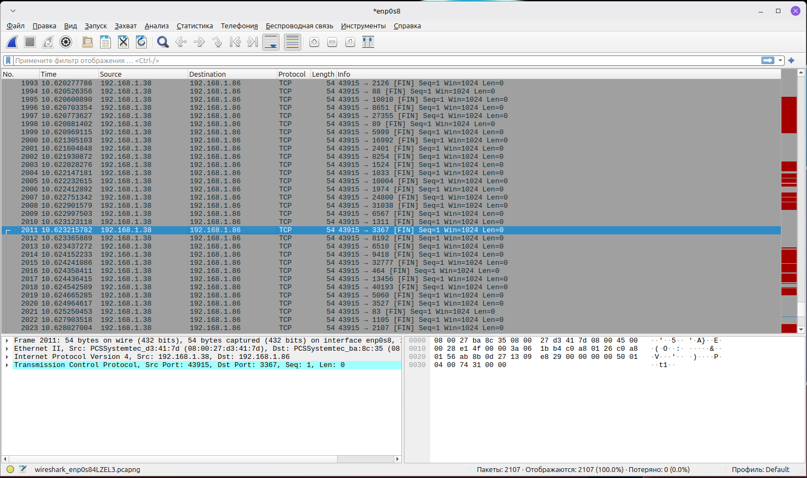
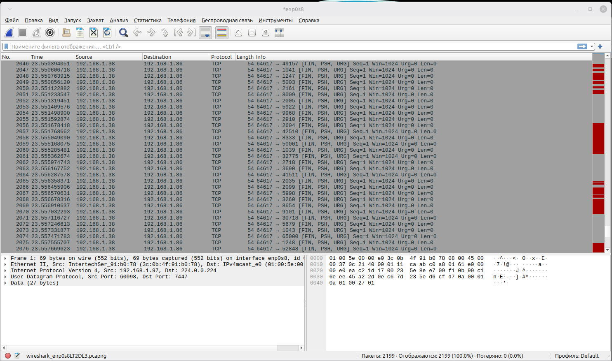
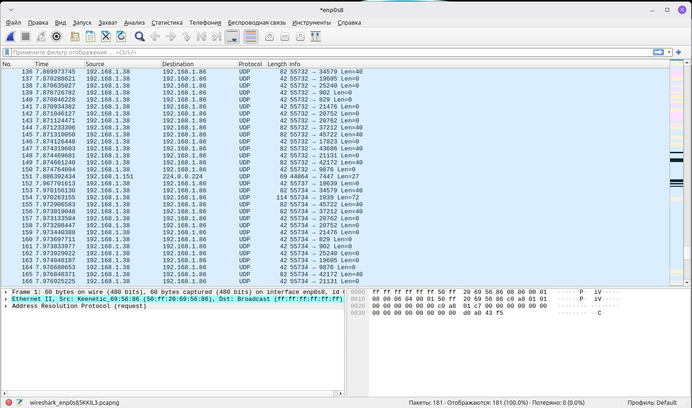

# Домашнее задание к занятию "`Уязвимости и атаки на информационные системы`" - `Александр М.`

### Задание 1

Скачайте и установите виртуальную машину Metasploitable: https://sourceforge.net/projects/metasploitable/.

Это типовая ОС для экспериментов в области информационной безопасности, с которой следует начать при анализе уязвимостей.

Просканируйте эту виртуальную машину, используя **nmap**.

Попробуйте найти уязвимости, которым подвержена эта виртуальная машина.

Сами уязвимости можно поискать на сайте https://www.exploit-db.com/.

Для этого нужно в поиске ввести название сетевой службы, обнаруженной на атакуемой машине, и выбрать подходящие по версии уязвимости.

Ответьте на следующие вопросы:

- Какие сетевые службы в ней разрешены?
- Какие уязвимости были вами обнаружены? (список со ссылками: достаточно трёх уязвимостей)
  
*Приведите ответ в свободной форме.*  

### Решение 1

```
nmap -sV 192.168.1.86
```
Команда `nmap -sV 192.168.1.86` показывает, какие программы и их версии работают на компьютере, и какие порты открыты.



Список уязвимостей:
1. [vsftpd 2.3.4 - Backdoor Command Execution](https://www.exploit-db.com/exploits/49757)
2. [PostgreSQL 8.2/8.3/8.4 - UDF for Command Execution](https://www.exploit-db.com/exploits/7855)
3. [nXFree86 4.2 - 'XLOCALEDIR' Local Buffer Overflow (3)](https://www.exploit-db.com/exploits/22322)
4. [ISC BIND (Linux/BSD) - Remote Buffer Overflow (1)](https://www.exploit-db.com/exploits/19111)
5. [ProFTPd 1.3 - 'mod_sql' 'Username' SQL Injection](https://www.exploit-db.com/exploits/32798)
6. ...И еще очень много...
---

### Задание 2

Проведите сканирование Metasploitable в режимах SYN, FIN, Xmas, UDP.

Запишите сеансы сканирования в Wireshark.

Ответьте на следующие вопросы:

- Чем отличаются эти режимы сканирования с точки зрения сетевого трафика?
- Как отвечает сервер?

*Приведите ответ в свободной форме.*

### Решение 2
SYN-сканирование:

Отправляются пакеты с флагом SYN, Самый популярный метод, работает быстро и не заставляет службы писать лог о завершенном соединении, т.к. руку не дожимаем. 

Если порт открыт, сервер отвечает пакетом SYN-ACK. Если закрыт RST.



FIN-сканирование:

Отправляются пакеты с флагом FIN, флаг используется для завершения соединения.

Если порт открыт, пакет игнорируется, сервер не отвечает, если закрыт RST.



Xmas-сканирование:

Отправляются пакеты сразу с тремя флагами FIN, PSH и URG, новогодняя елочка.

Также, как и с FIN, сервер не отвечает, если порт открыт, если закрыт RST.



UDP-сканирование:

Вместо TCP шлем пустые UDP пакеты. UDP не требует установки соединения.

Сервер не отвечает на открытых портах(Крме таких как DNS). Если порт закрыт, от сервера есть сообщения "Port Unreachable"



---
