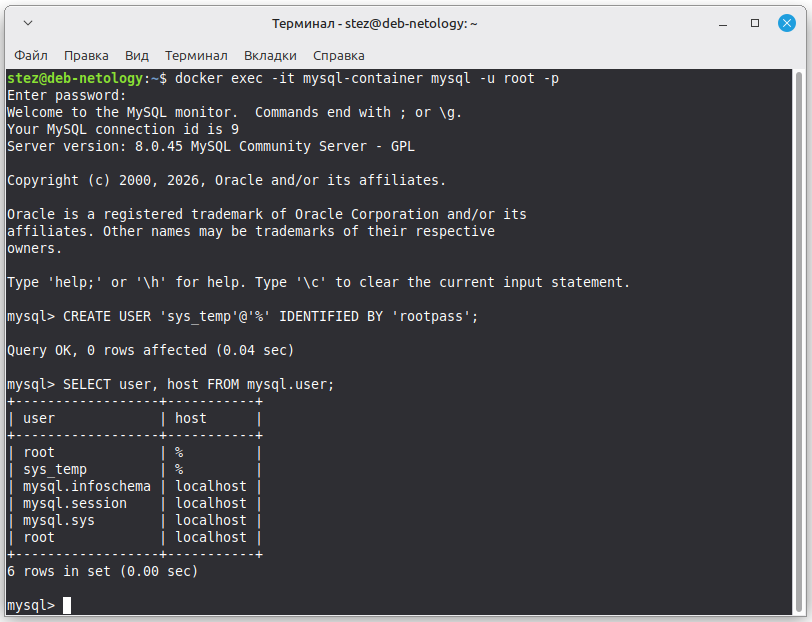
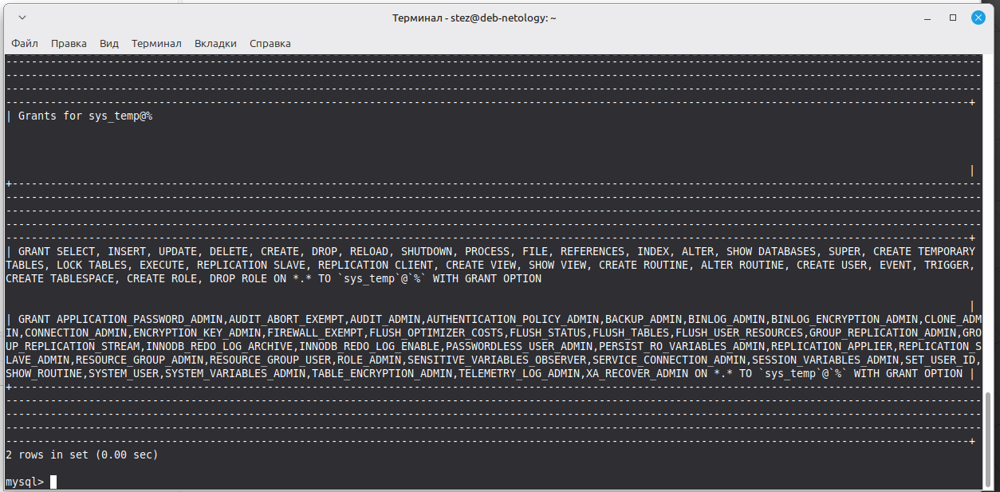
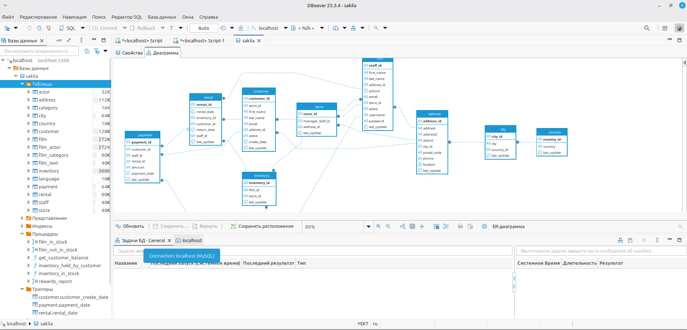
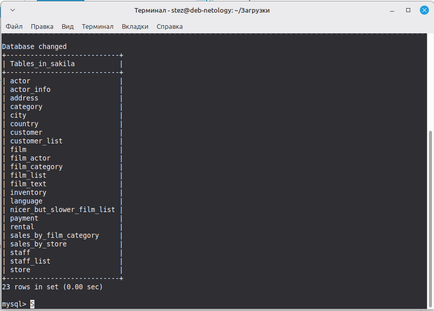
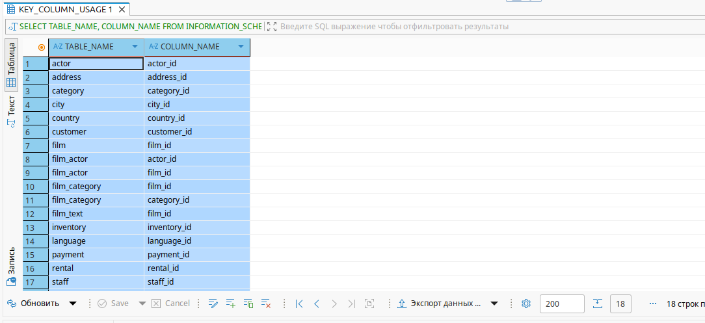
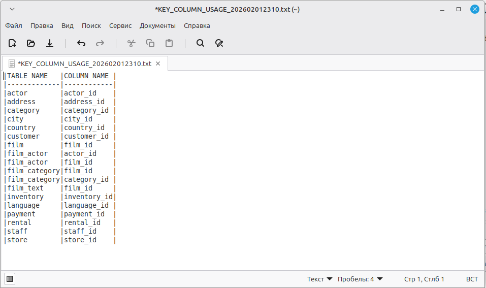
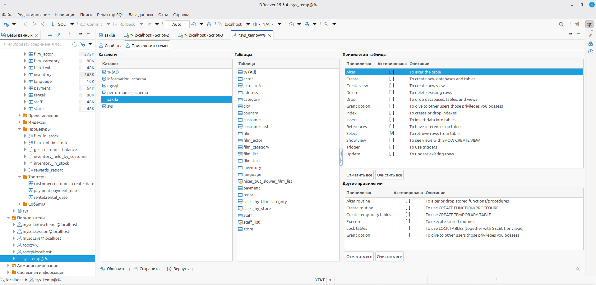
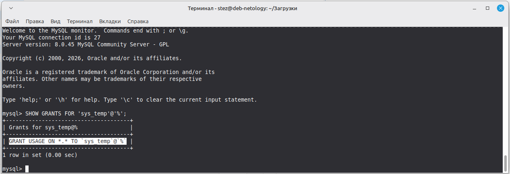

# Домашнее задание к занятию "`Работа с данными (DDL/DML)`" - `Александр М.`

### Задание 1
1.1. Поднимите чистый инстанс MySQL версии 8.0+. Можно использовать локальный сервер или контейнер Docker.

1.2. Создайте учётную запись sys_temp. 

1.3. Выполните запрос на получение списка пользователей в базе данных. (скриншот)



1.4. Дайте все права для пользователя sys_temp. 

1.5. Выполните запрос на получение списка прав для пользователя sys_temp. (скриншот)



1.6. Переподключитесь к базе данных от имени sys_temp.

Для смены типа аутентификации с sha2 используйте запрос: 
```sql
ALTER USER 'sys_test'@'localhost' IDENTIFIED WITH mysql_native_password BY 'password';
```
1.6. По ссылке https://downloads.mysql.com/docs/sakila-db.zip скачайте дамп базы данных.

1.7. Восстановите дамп в базу данных.

1.8. При работе в IDE сформируйте ER-диаграмму получившейся базы данных. При работе в командной строке используйте команду для получения всех таблиц базы данных. (скриншот)





1. `docker run --name mysql-container -e MYSQL_ROOT_PASSWORD=rootpass -p 3306:3306 -d mysql:8.0`
2. `docker exec -it mysql-container mysql -u root -p`
3. `CREATE USER 'sys_temp'@'%' IDENTIFIED BY 'userpass';`
4. `SELECT user, host FROM mysql.user;`
5. `GRANT ALL PRIVILEGES ON *.* TO 'sys_temp'@'%' WITH GRANT OPTION; FLUSH PRIVILEGES;`
6. `SHOW GRANTS FOR 'sys_temp'@'%';`
7. `ALTER USER 'sys_temp'@'%' IDENTIFIED WITH mysql_native_password BY 'userpass'; FLUSH PRIVILEGES;`
8. `docker exec -it mysql-container mysql -u sys_temp -p`


---

### Задание 2
Составьте таблицу, используя любой текстовый редактор или Excel, в которой должно быть два столбца: в первом должны быть названия таблиц восстановленной базы, во втором названия первичных ключей этих таблиц. Пример: (скриншот/текст)
```
Название таблицы | Название первичного ключа
customer         | customer_id
```


---

### Задание 3*
3.1. Уберите у пользователя sys_temp права на внесение, изменение и удаление данных из базы sakila.

3.2. Выполните запрос на получение списка прав для пользователя sys_temp. (скриншот)


