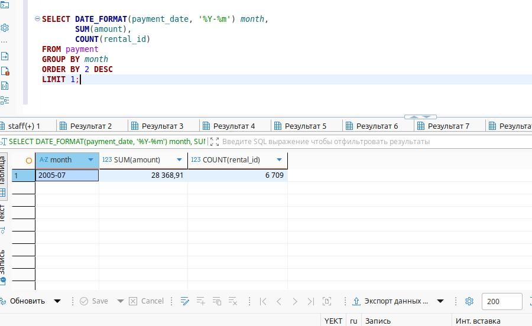
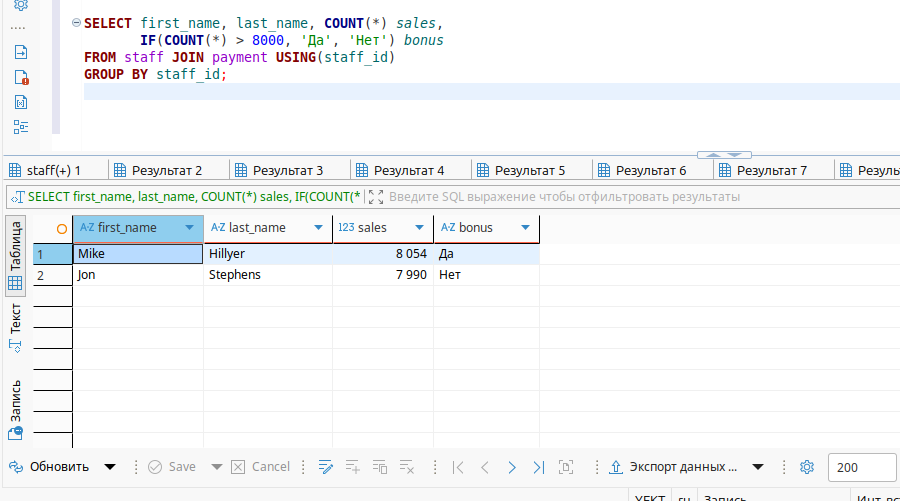
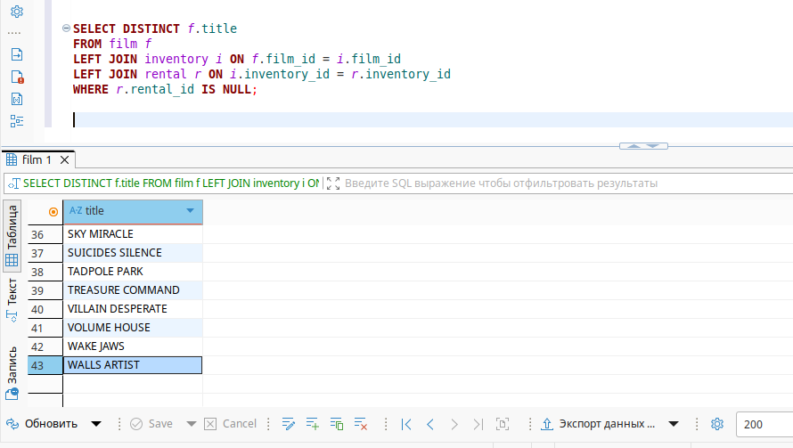

# Домашнее задание к занятию "`SQL. Часть 2`" - `Александр М.`

### Задание 1

Одним запросом получите информацию о магазине, в котором обслуживается более 300 покупателей, и выведите в результат следующую информацию: 
- фамилия и имя сотрудника из этого магазина;
- город нахождения магазина;
- количество пользователей, закреплённых в этом магазине.

```
SELECT s.first_name, s.last_name, c.city, COUNT(DISTINCT cu.customer_id) AS customer_count
FROM store st
JOIN staff s ON st.manager_staff_id = s.staff_id
JOIN address a ON st.address_id = a.address_id
JOIN city c ON a.city_id = c.city_id
JOIN customer cu ON st.store_id = cu.store_id
GROUP BY st.store_id, s.staff_id, c.city
HAVING COUNT(DISTINCT cu.customer_id) > 300;
```


---

### Задание 2

Получите количество фильмов, продолжительность которых больше средней продолжительности всех фильмов.

```
SELECT COUNT(f.title)
FROM film f
WHERE f.length > (
    SELECT AVG(length) 
    FROM film
);
```


---

### Задание 3

Получите информацию, за какой месяц была получена наибольшая сумма платежей, и добавьте информацию по количеству аренд за этот месяц.

```
SELECT DATE_FORMAT(payment_date, '%Y-%m') month,
       SUM(amount),
       COUNT(rental_id)
FROM payment 
GROUP BY month
ORDER BY 2 DESC
LIMIT 1;

```



---

### Задание 4*

Посчитайте количество продаж, выполненных каждым продавцом. Добавьте вычисляемую колонку «Премия». Если количество продаж превышает 8000, то значение в колонке будет «Да», иначе должно быть значение «Нет».

```
SELECT first_name, last_name, COUNT(*) sales,
       IF(COUNT(*) > 8000, 'Да', 'Нет') bonus
FROM staff JOIN payment USING(staff_id)
GROUP BY staff_id;
```



---

### Задание 5*

Найдите фильмы, которые ни разу не брали в аренду.

```
SELECT DISTINCT f.title
FROM film f
LEFT JOIN inventory i ON f.film_id = i.film_id
LEFT JOIN rental r ON i.inventory_id = r.inventory_id
WHERE r.rental_id IS NULL;
```


