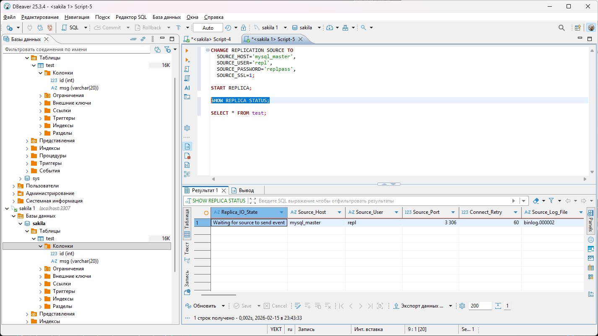
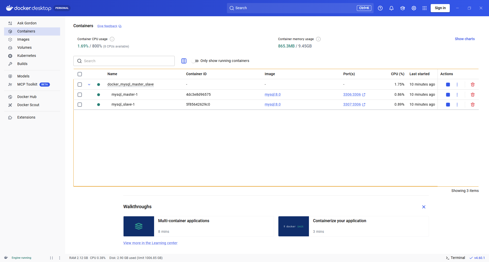
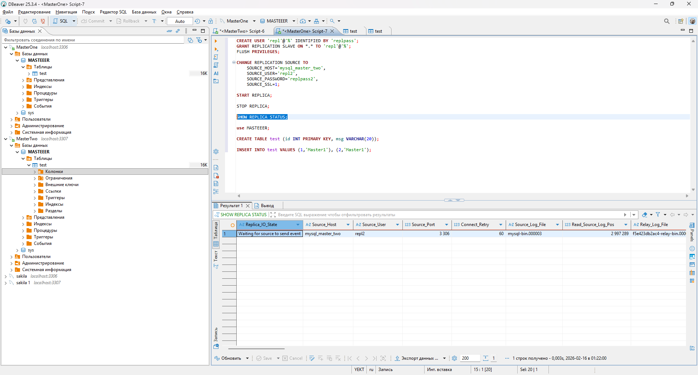
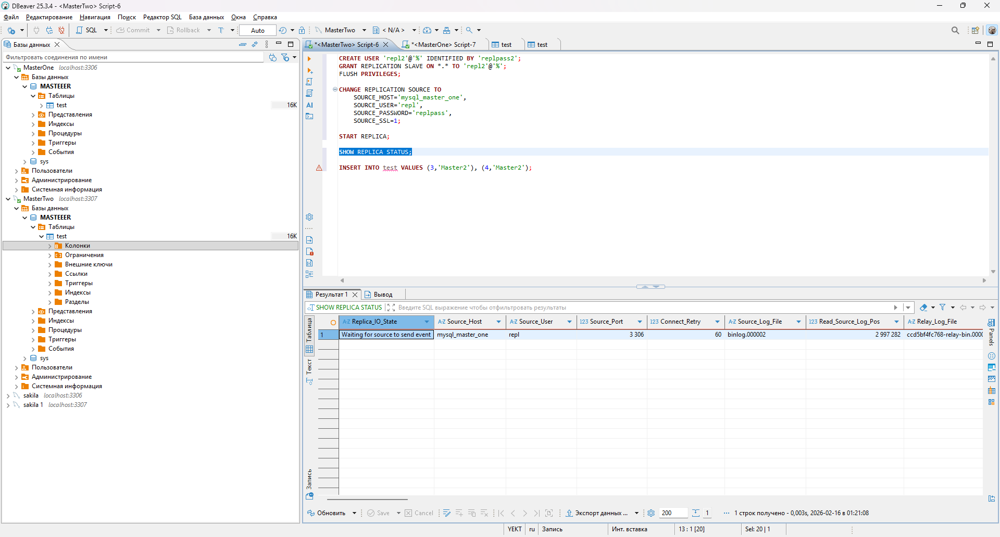
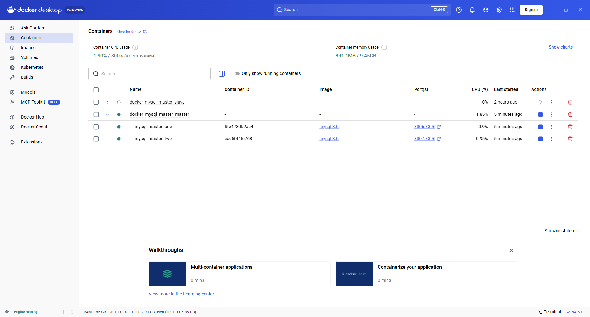

# Домашнее задание к занятию "`Репликация и масштабирование. Часть 1`" - `Александр М.`

### Задание 1

На лекции рассматривались режимы репликации master-slave, master-master, опишите их различия.

*Ответить в свободной форме.*


```
Master - принимает записи от всех,  Slave - только копирует, сами писать не может

```

```
Master-Master - оба и пишут, и копируют друг у друга

```


---

### Задание 2

Выполните конфигурацию master-slave репликации, примером можно пользоваться из лекции.

*Приложите скриншоты конфигурации, выполнения работы: состояния и режимы работы серверов.*

[DOCKER MASTER SLAVE](docker_mysql_master_slave/)
```
###### master.sql

CREATE USER 'repl'@'%' IDENTIFIED BY 'replpass';
GRANT REPLICATION SLAVE ON *.* TO 'repl'@'%';
FLUSH PRIVILEGES;
```
```
SHOW MASTER STATUS;
```
```
###### slave.sql

CHANGE REPLICATION SOURCE TO
  SOURCE_HOST='mysql_master',
  SOURCE_USER='repl',
  SOURCE_PASSWORD='replpass',
  SOURCE_SSL=1;
START REPLICA;
```
```
SHOW REPLICA STATUS;
```
```
###### master.sql

use sakila;
CREATE TABLE test (id INT PRIMARY KEY, msg VARCHAR(20));
INSERT INTO test VALUES (1,'Master'), (2,'Test');
```



---

### Задание 3* 

Выполните конфигурацию master-master репликации. Произведите проверку.

*Приложите скриншоты конфигурации, выполнения работы: состояния и режимы работы серверов.*

[DOCKER MASTER MASTER](docker_mysql_master_master/)
```
###### masterone.sql

CREATE USER 'repl'@'%' IDENTIFIED BY 'replpass';
GRANT REPLICATION SLAVE ON *.* TO 'repl'@'%';
FLUSH PRIVILEGES;

CHANGE REPLICATION SOURCE TO
    SOURCE_HOST='mysql_master_two',
    SOURCE_USER='repl2',
    SOURCE_PASSWORD='replpass2',
    SOURCE_SSL=1;

START REPLICA;

```
```
SHOW REPLICA STATUS;
```
```
###### mastertwo.sql

CREATE USER 'repl2'@'%' IDENTIFIED BY 'replpass2';
GRANT REPLICATION SLAVE ON *.* TO 'repl2'@'%';
FLUSH PRIVILEGES;

CHANGE REPLICATION SOURCE TO
    SOURCE_HOST='mysql_master_one',
    SOURCE_USER='repl',
    SOURCE_PASSWORD='replpass',
    SOURCE_SSL=1;

START REPLICA;
```
```
SHOW REPLICA STATUS;
```
```

###### masterone.sql

use MASTEEER;
CREATE TABLE test (id INT PRIMARY KEY, msg VARCHAR(20));
INSERT INTO test VALUES (1,'Master1'), (2,'Master1');
```

```
###### mastertwo.sql

INSERT INTO test VALUES (3,'Master2'), (4,'Master2');
```




